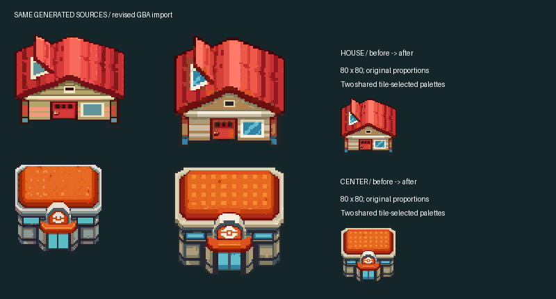
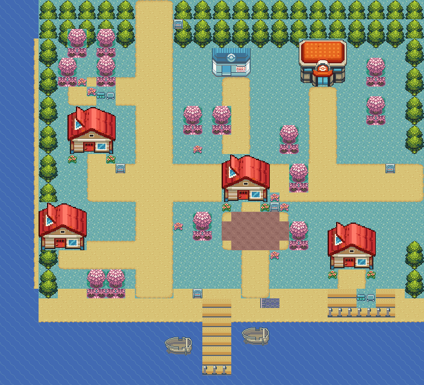
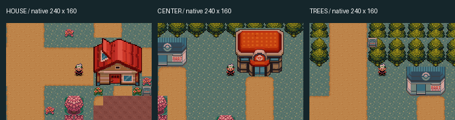

# Cherrygrove art — resume here

**Latest owner direction:** the house and Center designs are accepted. The next
revision keeps them unchanged, corrects the stacked tree crown and scenery
backgrounds, and realigns the town with HGSS geography. See
[revision 3](../gba/art/johto-v3/README.md). The images below retain the recovered
revision 2 baseline for comparison; the earlier proposed house variants are not
the current task.

Recovered 2026-09-13 from the repository and both recent conversations. This
page brings the existing work together for the next visual revision; it does
not introduce a new art version or approve the current town layout.

## Direction recovered from the conversations

- **Review Claude findings** (`01a098c1-32f1-7212-bf18-c88523296528`): qualify
  maps outside Hoenn, build Cherrygrove first, then reproduce Johto's aesthetic
  using recognizable references. Recoloring Emerald scenery alone was insufficient.
- **Recover disappeared chat** (`01a09a15-e6b2-7bd2-9cdb-5aae4364e5d7`): the
  owner preferred the generated house and Pokémon Center over their first map
  imports and asked to use those designs. Revision 2 corrected the import;
  it did not generate replacement designs.
- Current request: resume building refinement and city construction on
  Emerald-expansion. Visual work is explicitly in scope for this continuation.

## The generated designs

These are the selected source images, before native pixel and palette reduction.

| House | Pokémon Center | Tree |
| --- | --- | --- |
| [Generated house](../gba/art/johto-v1/generated/house-final.png) | [Generated Center](../gba/art/johto-v1/generated/center.png) | [Generated tree](../gba/art/johto-v1/generated/tree-alpha.png) |

Reference crops, generation prompts and provenance are in the
[original sample pack](../gba/art/johto-v1/README.md).

## Latest imported buildings

The right-hand imports preserve the source proportions at 80 × 80 native pixels.
Two shared building palettes preserve more roof, façade and glass detail.
The green tree remains the first 32 × 48 import.

## Current city

This is an **offline source render**, not an emulator screenshot. The town is
44 × 40 metatiles, with four homes, Mart, Center, blossom park, Gold's practice
yard, southern pier and lookout. Route 29 exits east; Route 30 exits north.
All four houses currently repeat the same red-roof design. The Mart, blossom
trees, terrain, waterfront and interiors still use the earlier prototype art.

[Movement capture](../gba/art/johto-v2/evidence/walk.gif) ·
[Playable revision 2 package](../tools/vendor/gba/Johto-art-v2-preview.zip)

## Proposed next art sequence

1. Refine the house family from the preferred generated source: simplify noisy
   roof shading at native scale, retain the skylight and timber/plaster frontage,
   and develop distinct variants for the four homes. Gold's house should regain
   its understated weathered character; its current red copy loses that distinction.
2. Refine the Center's roof and entrance readability, then produce a matching
   Johto Mart. Keep both service buildings recognizable from the walking view.
3. Build a flowering tree variant consistent with the green Johto tree, then
   refine the park, path edges and weathered waterfront as one town composition.
4. Integrate each selected revision into the isolated preview, inspect native
   emulator captures and movement, and verify doors, collision and tile capacity.

These are proposals for visual review. Canon remains a small, quiet seaside town
aged through detail and weathering: a mature blossom grove, modest transplant
homes, idle fishing boats and a beloved local Gold without a monument or shrine
([DESIGN.md](../DESIGN.md), Chapter 1 — World & Map Design).

## Source and evidence

- Latest art source and reproduction: [johto-v2 README](../gba/art/johto-v2/README.md).
- Town layout source: [town.json](../gba/maps/cherrygrove/town.json).
- Town context and implementation limits: [CHERRYGROVE_GBA.md](CHERRYGROVE_GBA.md).
- Isolated checkout: `tools/vendor/gba/johto-art-v2-game`.
- Preserved engine changes: `gba/johto-art-v2.patch`, applied directly to town
  baseline `f09ec1de2e6754e9f9a8e02281d3d773efcfa65e`; do not stack on the v1 patch.
- [Recorded build/runtime evidence](../gba/art/johto-v2/evidence/build.json):
  successful build and three successful runtime/save phases, with 402/512
  secondary tiles and 231/512 secondary metatiles used.

The evidence above belongs to the existing revision 2 build, not a fresh build
from this recovery. Opening scenes, Gold/Kestra/Silver art and starter events
remain unimplemented. Production mechanics continued separately in `game/`.
